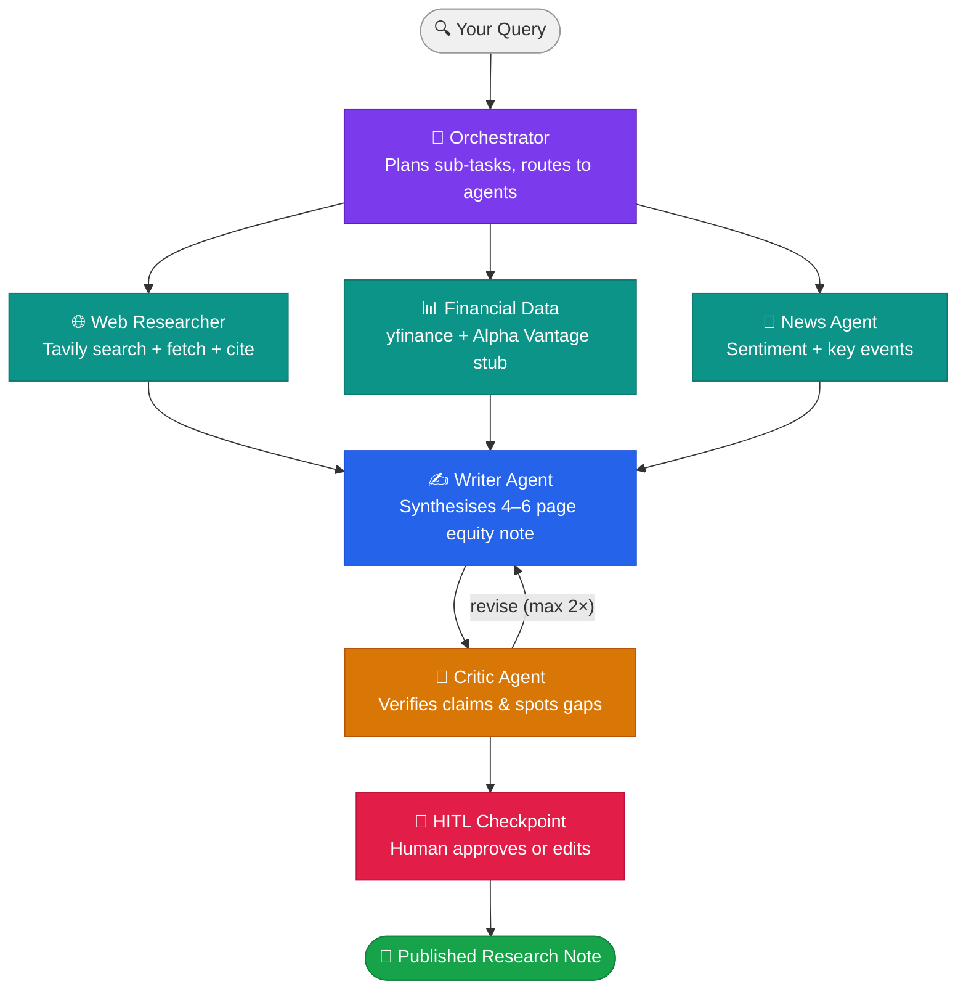

# AlphaAgents — Multi-Agent Equity Research System

> A multi-agent AI pipeline that takes a company or sector query and produces a cited, 4-6 page equity research note in under 5 minutes — with a human-in-the-loop approval step before publication.

[](https://www.python.org/)
[](https://github.com/langchain-ai/langgraph)
[](https://groq.com/)
[](LICENSE)


---

## What It Does

Senior equity analysts spend 4-8 hours per research note — sourcing financial data, reading filings, scanning news, and writing a structured investment thesis. AlphaAgents compresses that pipeline into 5 minutes using a coordinated team of AI agents.

You type: `"Analyse Reliance Industries for a retail investor"`

You get: a 4-6 page structured note with investment thesis, key risks, valuation summary, comparable companies, and a buy/hold/sell recommendation — fully cited, critic-reviewed, and human-approved.

---

## Architecture



---

## Tech Stack

| Layer | Tool | Why |
|---|---|---|
| Agent framework | LangGraph (Python) | Stateful graph, conditional routing, native tool-use |
| LLM | Groq — Llama-3.3-70B | Free tier, fast inference, 128K context |
| Web search | Tavily Search API | Structured results, built for LLM pipelines |
| Financial data | yfinance + Alpha Vantage stub | yfinance is free; AV free tier cached locally |
| News | NewsAPI | Free tier, responses cached on first call |
| Tracing | Langfuse | Prompt + trace + eval observability |
| Vector memory | FAISS + HuggingFace embeddings | Long-term context from past research |
| UI | Streamlit | HITL interface with live streaming output |
| Deployment | HuggingFace Spaces | Free, Docker-based |

---

## Quick Start

### Prerequisites
- Python 3.11+
- A [Groq API key](https://console.groq.com/) (free)
- A [Tavily API key](https://tavily.com/) (free tier)
- A [NewsAPI key](https://newsapi.org/) (free tier)
- A [Langfuse](https://langfuse.com/) account (free tier)

### Setup

```bash
git clone https://github.com/Abhijain01/alphaagents.git
cd alphaagents

python -m venv venv
source venv/bin/activate  # Windows: venv\Scripts\activate

pip install -r requirements.txt

cp .env.example .env
# Fill in your API keys in .env
```

### Run

```bash
# Run the full pipeline on a single query
python -m alphaagents.pipeline --query "Analyse HDFC Bank for a retail investor"

# Launch the Streamlit HITL UI
streamlit run app.py

# Run the eval suite (20 queries)
python -m alphaagents.eval.run
```

---

## Project Structure

```
alphaagents/
├── alphaagents/
│   ├── agents/
│   │   ├── orchestrator.py      # Plans and routes research tasks
│   │   ├── web_researcher.py    # Tavily search + fetch + summarise
│   │   ├── financial_data.py    # yfinance + Alpha Vantage stub
│   │   ├── news_agent.py        # NewsAPI sentiment + key events
│   │   ├── writer.py            # Synthesises the equity note
│   │   └── critic.py            # Reviews for unsupported claims
│   ├── graph/
│   │   ├── state.py             # LangGraph state schema (Pydantic)
│   │   └── pipeline.py          # Full agent graph definition
│   ├── tools/
│   │   ├── search.py            # Tavily wrapper
│   │   ├── finance.py           # yfinance + caching layer
│   │   └── news.py              # NewsAPI wrapper
│   ├── eval/
│   │   ├── queries.json         # 20 sample eval queries
│   │   ├── run.py               # LLM-as-judge eval runner
│   │   └── results/             # Eval output reports
│   └── utils/
│       ├── cache.py             # Local JSON caching for all APIs
│       └── prompts.py           # System prompts for each agent
├── app.py                       # Streamlit HITL UI
├── docs/
│   ├── initial_design_doc.pdf   # Initial design document (Week 0)
│   ├── adr/
│   │   ├── ADR001-framework-choice.md
│   │   ├── ADR002-llm-provider.md
│   │   └── ADR003-eval-strategy.md
│   └── postmortem.md            # Written after final submission
├── tests/
│   ├── test_agents.py
│   ├── test_graph.py
│   └── test_tools.py
├── .env.example
├── requirements.txt
├── Dockerfile
└── README.md
```

---

## Evaluation

The eval suite runs 20 sample equity queries through the full pipeline and scores each output on three dimensions using an LLM-as-judge framework:

| Dimension | What it measures |
|---|---|
| Factuality | Are all claims supported by cited sources? |
| Completeness | Does the note cover thesis, risks, valuation, and comps? |
| Actionability | Would a retail investor know what to do after reading this? |

Results are logged to Langfuse and saved as a JSON report in `eval/results/`.

---

## Architecture Decision Records

| ADR | Decision |
|---|---|
| [ADR001](docs/adr/ADR001-framework-choice.md) | Why LangGraph over CrewAI and AutoGen |
| [ADR002](docs/adr/ADR002-llm-provider.md) | Why Groq over OpenAI for this use case |
| [ADR003](docs/adr/ADR003-eval-strategy.md) | Why LLM-as-judge over RAGAS for this eval |

---

